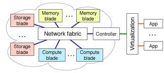
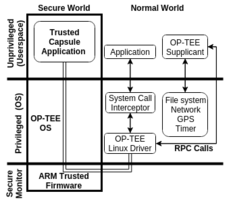

# Welcome! 

{: .image-face}
Hello! I am currently a graduating Masters
student at the University of British Columbia. I work in the [NSS Lab](http://nss.cs.ubc.ca) under the supervision of 
[Ivan Beschastnikh](http://www.cs.ubc.ca/~bestchai/). My research interests, 
broadly, are in operating systems, distributed systems, and datacenter networking.

 
## Research

{: .image-right} **Disaggregated Datacenters.**
Recent research shows that disaggregated datacenters (DDCs) are practical and
that DDC resource modularity will benefit both users and operators. My work
explores the implications of disaggregation on system design assumptions 
\[[HotNets17](https://doi.org/10.1145/3152434.3152447)]. 

 
{: .image-right} [**Trusted Capsules: Graduated Access Control.**](https://github.com/TrustedCapsules)
Security of data is tightly coupled to its access policy. However, in practice,
a data owner has control of his data's access policies only as far as the
boundaries of his own systems. _Graduated access control_ provides mobile,
programmable, and dynamically-resolving policies for access control that extends
a data owner's policies across system boundaries. It utilizes ARM TrustZone as a
trusted third party on the remote device to execute policy and evaluate access.

 
{: .image-right} [**BlueBridge: distributed
NUMA.**](https://github.com/FRuffy/BlueBridge) Named after the beer which won our lab tasting competition,
BlueBridge is the realization of distributed NUMA (dNUMA). dNUMA exposes a
_distributed_ global address space to applications by implementing virtual
memory in the network. Hosts operate on local memory (the cache) and pages fault
to remote memory. Implemented in C with raw sockets. Remote pointers are stored
as IPv6 addresses which contain a remote machine prefix with the memory address.

 
## Publications

<table>
  <tr>
    <td><a href="hotnets17-camera-ready.pdf">pdf</a></td>
    <td rowspan="3"> <strong>Amanda Carbonari</strong> and Ivan Beschasnikh. 2017. Tolerating Faults in Disaggregated Datacenters. In Proceedings of the 16th ACM Workshop on Hot Topics in Networks. HotNets-XVI.</td>
  </tr>
  <tr>
    <td><a href="hotnets17-slides.pdf">HotNets17 slides</a></td>
  </tr>
  <tr>
    <td><a href="extended-slides.pdf">Extended slides</a></td>
  </tr>
</table>

<!-- ## Work Experience

### Masters Intern at the Pacific Northwest National Laboratory (PNNL)
I interned with the National Security Internship Program (NSIP) which involves a technical paper and an oral presentation detailing the work completed over the internship.

During my internship, I worked on two projects:

- _Analysis in Motion_: Researching the implementation of an image inpainting algorithm on a streaming distributed GPU cluster using OpenCL to reduce latency and still maintain accuracy. Mentored by Dimitri Zarzhitsky.
- _Cyber Intelligence Center_: Creating and optimizing Apache Spark scripts to improve data ingest and provide preliminary statistics about the dataset. Mentored by Bryan Gerber.

### Part-Time Software Engineer at LogRhythm, Inc.
Continuing off of the work I started during my Internship, I have mainly been working in Automation. I work with Quality Assurance Engineers refactor the tools I wrote. I utilize Jenkins Continuous Integration to automatically run some of the automation once a build has completed. A majority of the scripts have been in python while future projects will involve other languages such as C++.

### Software Engineering Intern at LogRhythm, Inc.

- Spearheaded automated testing for the Network Monitor Tool.
- Delegated tasks between myself and another engineering intern to achieve efficiency and balance team priorities. Here I gained insight on the Agile programming process by using Rally to create Epics, Features, and User Stories for the tasks we were asked to implement.
- Implemented five separate automation tests utilizing both python and bash scripting. I demoed two of the tests I wrote to the engineering department as a part of biweekly team demos. These tests covered a variety of things from build verification to log monitoring to determine system health.
- Created wiki pages for each tool and general scripts I wrote in order to detail the design process, assumptions made during the implementation, as well as usage and expected output.

### Software Engineering Intern at Intel

- Developed parsing scripts to synthesize and count the number of errors in an error file. The scripts produced a summary for the specific error file and an overall summary file of the entire design.
- Received project team recognition award for merging two tools into one to create efficiency and usability as well as enabling broad adoption of a single tool set for designers.
- Developed an automation script to reduce the number of specific errors in a design.

### Software Engineering Intern at Welch Allyn, Inc.
Through the Apprenticeships in Science and Engineering program sponsored by the Saturday Academy

**Overall Program Goal:** improve the understandability of error and event logs form the Connex Vital Sign Monitor 6000 (CVSM600).

- Context:
    - Inherited code from a project to create a tool to fit their needs.
    - Code was written in C# and was poorly documented.
    - Ultimately a complete overhaul (GUI and backend) was needed to get the code to work.
- Basic Features Needed:
    - A way to display error log, event log, and a merged version.
    - The display should split the logs into "runs" (start-up to shut-down).
    - It should also display if the selected line is a known error.
- Completed Features:
    - Created a single tool to do all requirements.
    - _Multiple Runs and Merged Logs:_ displayed both logs and the merged versions for a single run or multiple runs.
    - _Known Error Description:_ provided capability to display known errors when selected as well as add new errors or modify the error description.
    - _Exclude/Show-only:_ allowed the developer to choose one or many lines to exclude or show-only. Both modifications could be used at the same time. One check box would toggle them on and off for an easy transition between the two views.
    - _Notes:_ the develop had the capability to add a note to any log entry. These notes would carry over into the error/event only view and the merged view. They would still remain even if the log entry was removed using exclude only. It allowed the developer to use the tool as a debugging aid, storing their thoughts about each log line as they made discoveries.
    - _Save Sessions:_
        - Allowed the developer to save their entire tool environment into a zip file that could be sent via email to any other developer.
        - Saved what was excluded/show-only, all notes, any changes or additions to error descriptions, etc.
        - Improved collaboration between developers by allowing them to remotely "share" their debugging environment.
        - Eliminated the need for lenghty emails in order to describe why they thought the error occurred on line xyz.

At the end of my internship I developed a presentation and poster board explaining my project and presented it at the Apprenticeships in Science and Engineering Symposium. -->

 
## About me

