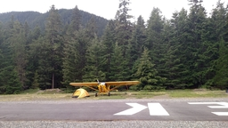

# Welcome! 

{: .image-face}
Hello! I am currently a graduating Masters
student at the University of British Columbia. I work in the [NSS Lab](http://nss.cs.ubc.ca) under the supervision of 
[Ivan Beschastnikh](http://www.cs.ubc.ca/~bestchai/). My research interests, 
broadly, are in operating systems, distributed systems, and datacenter networking.

 
## Research

{: .image-right} **Disaggregated Datacenters.**
Recent research shows that disaggregated datacenters (DDCs) are practical and
that DDC resource modularity will benefit both users and operators. My work
explores the implications of disaggregation on system design assumptions 
\[[HotNets17](https://doi.org/10.1145/3152434.3152447)]. 

 
{: .image-right} [**Trusted Capsules: Graduated Access Control.**](https://github.com/TrustedCapsules)
Security of data is tightly coupled to its access policy. However, in practice,
a data owner has control of his data's access policies only as far as the
boundaries of his own systems. _Graduated access control_ provides mobile,
programmable, and dynamically-resolving policies for access control that extends
a data owner's policies across system boundaries. It utilizes ARM TrustZone as a
trusted third party on the remote device to execute policy and evaluate access.

 
{: .image-right} [**BlueBridge: distributed
NUMA.**](https://github.com/FRuffy/BlueBridge) Named after the beer which won our lab tasting competition,
BlueBridge is the realization of distributed NUMA (dNUMA). dNUMA exposes a
_distributed_ global address space to applications by implementing virtual
memory in the network. Hosts operate on local memory (the cache) and pages fault
to remote memory. Implemented in C with raw sockets. Remote pointers are stored
as IPv6 addresses which contain a remote machine prefix with the memory address.

 
## Publications

<table>
  <tr>
    <td><a href="hotnets17-cameraready.pdf">pdf</a></td>
    <td rowspan="3"> <strong>Amanda Carbonari</strong> and Ivan Beschasnikh. 2017. Tolerating Faults in Disaggregated Datacenters. In Proceedings of the 16th ACM Workshop on Hot Topics in Networks. HotNets-XVI.</td>
  </tr>
  <tr>
    <td><a href="https://docs.google.com/presentation/d/17HjmAnEKr80IH4dzSdT4vtLmb0tEWGMj-198p6H-nvs/edit?usp=sharing">HotNets17 slides</a></td>
  </tr>
  <tr>
    <td><a href="https://drive.google.com/open?id=1fxaoAyTKUhu-i3j_IWqy7gO4JYyo8zeG28MqwVu5v20">Extended slides</a></td>
  </tr>
</table>

 
## About me

I was born and raised in Beaverton, OR. During my childhood, I started playing
soccer and fell in love with the sport. I only play recreationally now, but I do
love watching every game I can catch, at the stadium, in a pub, or just at home 
on the TV. For college, I moved to Fort Collins, CO where I attended Colorado State
University and graduated with my Bachelors of Science. 

{: .image-left}

While I was in Colorado I was able to pursue my pilot's license! I really enjoy
the freedom of flying yourself to locations. I find this freedom is best embodied
by plamping (plane camping). Plane camping allows you to explore campsites much
farther from your home base, but still make it possible in a weekend. I hope to
have many adventures in the future when I own my own plane.
